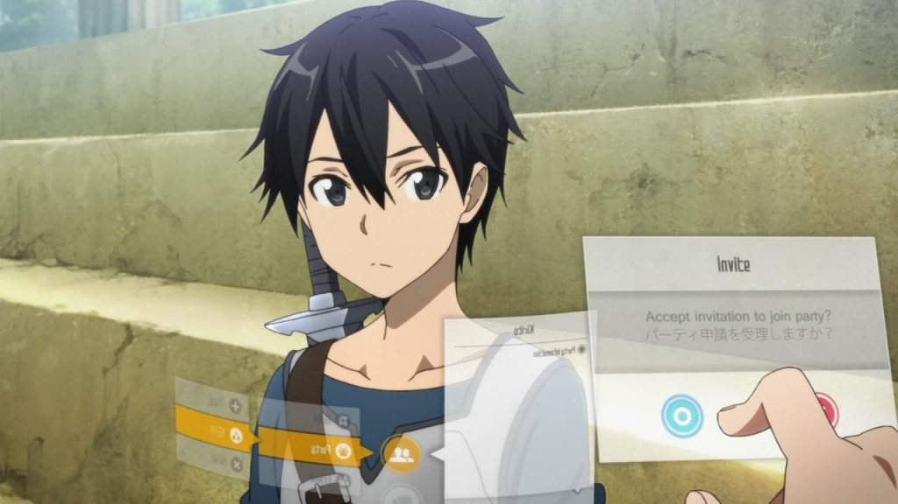

## Virtual World

<<<<<<< HEAD
You have gotten the newest MMORPG game and it is a VR game! While booting up the game, you noticed that you received an important message from the creator of the game. You're told that you are trapped in the virtual world and you can’t log out of it. If someone tries to remove the VR headset, you would get a system shock making your brain fried. Also, dying in the game will result in dying in real life. The only way to get out is to beat the game. When you enter the world, you are in a panic and you see a fellow player. Do you join them or go solo? 
=======
You have gotten the newest MMORPG game and it is a VR game! While booting up the game, you noticed that you received an important message from the creator of the game. You're told that you are trapped in the virtual world and you can’t log out of it. If someone tries to remove the VR headset, you would get a system shock making your brain fried. Also, dying in the game will result in dying in real life. The only way to get out is to beat the game. When you join the world, you are in a panic and you see a fellow player. Do you join them or go solo.
>>>>>>> 92e180b2fd0b4aa4eeb6983ed99e93e3f696a7d0

[Join](join.md)

[Solo](solo.md)
